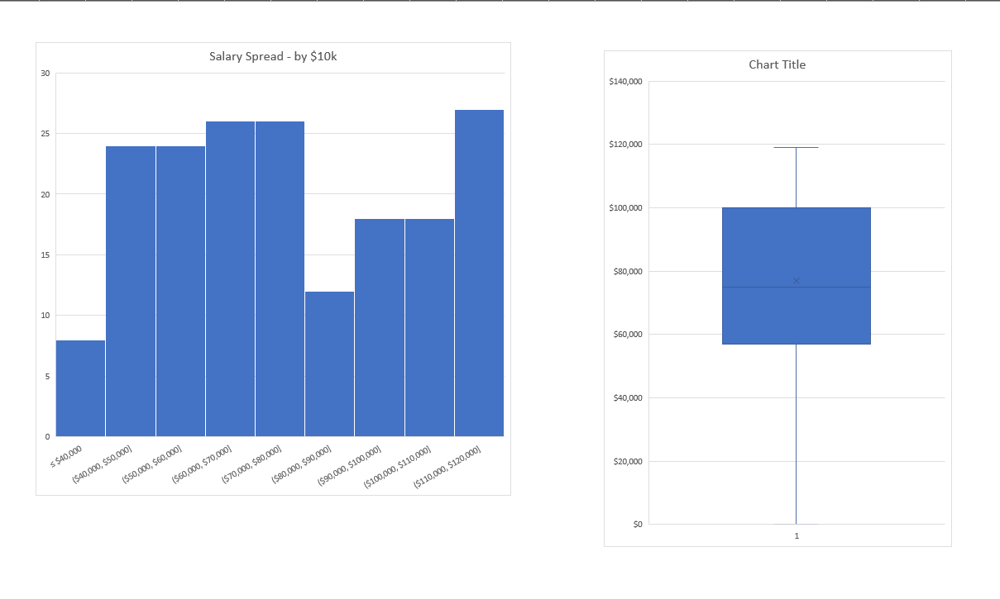
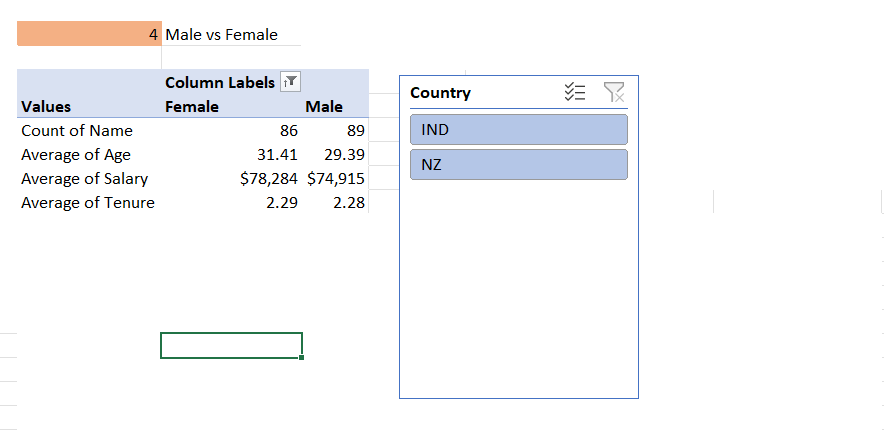
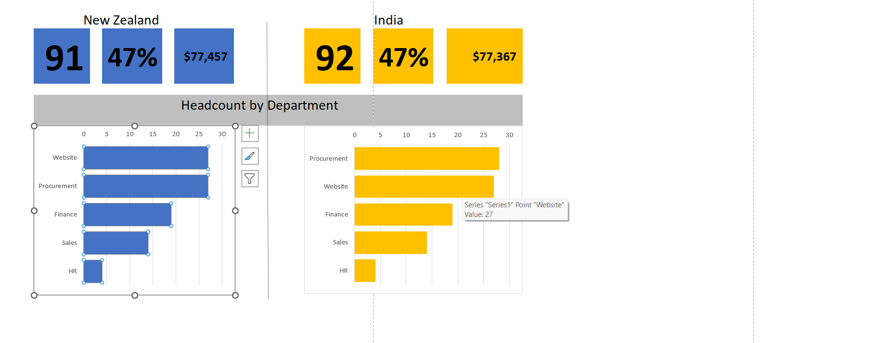
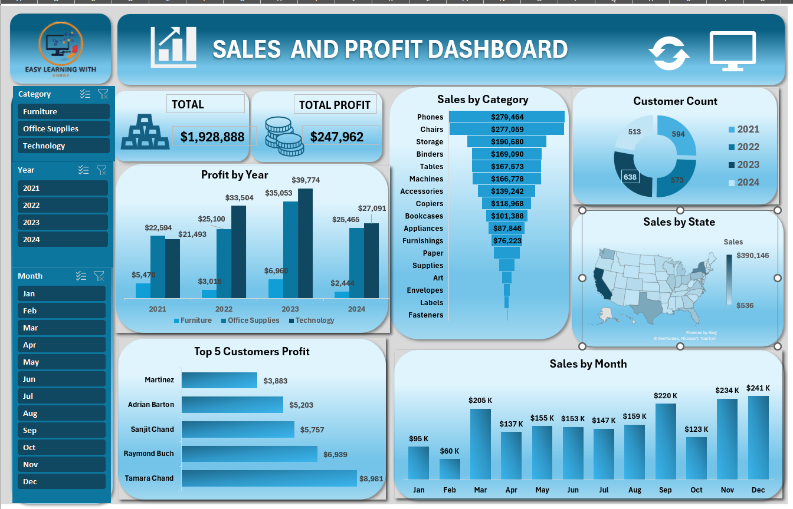

<h1 align="center">Israel Aidoo</h1>

  📊 Data Analyst • 🧠 Aspiring Data Engineer/Consultant • 👨‍🏫 Educator • 🌍 Community Builder  

  <a href="https://github.com/kobby-ia">GitHub</a> •
  <a href="https://kobby-ia.github.io/portfolio">Portfolio Website</a> •
  <a href="https://linkedin.com/in/issyaidoo/">LinkedIn</a>

---

## 👋 About Me

I'm a calm and collaborative professional with a background in Chemical Engineering, an educator by vocation, and a data enthusiast by passion. I love transforming messy data into actionable insights and building tools that help organizations — especially in education and nonprofit sectors — make better decisions.

- 💡 Skilled in Excel, Python (Pandas, Matplotlib), SQL, and basic machine learning
- 🧩 Interested in data consulting, analytics, and automation tools
- 🛠️ Builder of custom school management systems using Python & MySQL
- 🙌 Volunteer leader in church-based community development

---

## 🚀 Featured Project: Employee Analysis (India vs New Zealand)

📂 [View Full Project on GitHub »](https://github.com/Kobby-ia/portfolio/tree/main/employee-analysis-nz-ind)

A comparative Excel-based data analysis project exploring workforce trends between India and New Zealand — covering salaries, gender distribution, and education levels.

> 🛠 Tools: Microsoft Excel, Pivot Tables  
> 🔍 Focus: Data storytelling, visual analysis

### 📷 Key Visuals

#### 💰 Salary Comparison  

#### 👩‍💼 Gender Distribution  

#### 🎓 Education Levels  

---

## 🚀 Featured Project: Sales & Profit Analytics

📂 [View LinkedIn Project Post »](https://www.linkedin.com/posts/issyaidoo_dataanalytics-businessintelligence-salesgrowth-activity-7372545666503299072-3zw9?utm_source=share&utm_medium=member_desktop&rcm=ACoAACbJsloBJoi0hamc5CgnNn4czMIpHk9ZFQo)

📊 [Download Full Excel Project »](https://github.com/Kobby-ia/portfolio/blob/main/sales-profit-analysis/visuals/SALES_AND_PROFIT_PROJECT123.xlsx)

An Excel-driven analytics project transforming raw transactional data into actionable business insights on sales, profit, and customer behavior.

> 🛠 Tools: Microsoft Excel, Pivot Tables, Dashboards  
> 🔍 Focus: Sales performance, profitability analysis, customer segmentation  

### 📷 Key Highlights  

#### 📊 Sales by Region & State  
*Identified states with high sales but low profit margins — guiding pricing and discount strategy.*  

#### 📦 Category Profitability  
*Analyzed categories and sub-categories to highlight high-growth vs. loss-making products.*  

#### 👥 Customer Segmentation  
*Discovered top customer segments driving majority of profits — advised targeted marketing.*  

#### 📅 Seasonal Insights  
*Uncovered peak months for categories, enabling proactive promotional planning.*  

#### 📊 Sales & Profit Dashboard  

---
## 🛠️ Tools & Technologies

| Skillset         | Tools / Languages                      |
|------------------|----------------------------------------|
| Data Analysis     | Excel, Python (Pandas, NumPy)         |
| Visualization     | Matplotlib, Excel Charts              |
| Databases         | MySQL, SQLite                         |
| Reporting         | Excel, PDF exports, Report Templates  |
| Teaching & Mentoring | Curriculum planning, lesson delivery |
| Soft Skills       | Teamwork, leadership, outreach        |

---

## 🎓 Education & Volunteering

- **Educator**, CityBest International Montessori School  
  Teaching Math, English, and Creative Arts, and designing exams based on the GES/BECE syllabus.

- **Builder**, School Management System  
  Developed a full backend + GUI system for managing student records, attendance, classes, fees, and reports using Python & MySQL.

---

## 🎯 Career Goals

I aspire to:
- Become a **Data Consultant** helping schools, NGOs, and businesses optimize systems and scale
- Contribute to **Africa’s digital and data transformation**
- Use **data for social impact** and educational equity

---

## 📬 Let’s Connect

- 📧 Email: [iaidookobby@gmail.com](mailto:iaidookobby@gmail.com)  
- 📞 Phone: (+233) 599 742 594  
- 📄 [Download My CV](Israel_Aidoo_Updated_CV_with_Portfolio.pdf)  
- 🐙 GitHub: [@kobby-ia](https://github.com/kobby-ia)  
- 🌐 Website: [https://kobby-ia.github.io/portfolio](https://kobby-ia.github.io/portfolio)  
- 💼 LinkedIn: [https://linkedin.com/in/issyaidoo](https://linkedin.com/in/issyaidoo)

---

Built with 💡 and a love for data and learning.

