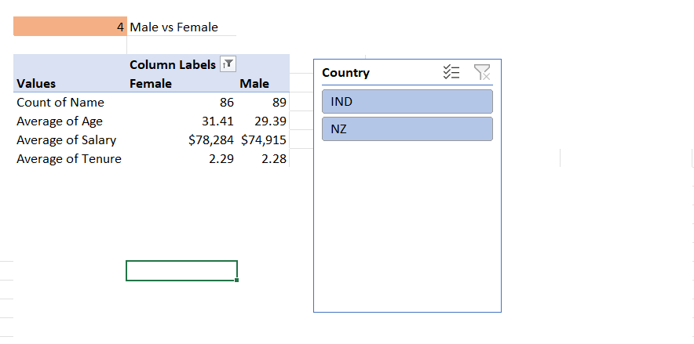

# 📊 Employee Analysis: India vs New Zealand

## Overview
This project is an exploratory data analysis comparing employees from **India** and **New Zealand** using Excel. It covers:

- Salary trends
- Gender representation
- Job roles
- Educational background

## Objectives
- Understand how workforce metrics differ across two countries
- Use visual insights to inform HR and business decisions

## Tools
- Microsoft Excel
- Pivot Tables, Charts, Filtering, Conditional Formatting

## Key Insights
- 💰 Indian employees earn less on average than NZ employees
- 👩‍💼 New Zealand shows better gender balance in senior roles
- 🎓 Higher education is more widespread in New Zealand
- 🧑‍💻 Tech roles dominate in both countries

## How to View
1. Open `Data Analysis on employees from NZ  and IND.xlsx`
2. Explore pivot tables and charts

## Author
Israel Aidoo ([GitHub](https://github.com/kobby-ia))

## 📷 Visual Insights

### Salary Comparison

### Gender Distribution

### Education Levels

